# metro-map — cheat sheet

One page. Everything else is in the [README](../README.md) and the
[skill](../metro_map_tool/skill/SKILL.md).

---

## Starting it

```bash
metro-map-designer                    # the browser designer, on :8765
metro-map spec.json -o map.svg        # render a file
metro-map-mcp                         # the MCP server, for agents
metro-map-skill --install             # install the agent skill
```

**Commands not on your PATH?** Every one has a `python -m` twin running the
same code — the named commands are only generated wrappers.

| command | as a module |
|---|---|
| `metro-map-designer` | `python3 -m metro_map_tool.app` |
| `metro-map` | `python3 -m metro_map_tool.metro_map` |
| `metro-map-mcp` | `python3 -m metro_map_tool.mcp_server` |
| `metro-map-skill` | `python3 -m metro_map_tool.skill_install` |

From a clone, use the virtual environment's interpreter — that is where Flask
lives:

```bash
cd metro-map-tool && .venv/bin/python -m metro_map_tool.app
```

Designer flags: `--port 9000`, `--host`, `--maps-dir`, `--no-update-check`,
`--debug`. Binding to anything but loopback prints a warning, because then
anyone who can reach the port can read and change your maps.

---

## Rendering

```bash
metro-map spec.json -o map.svg
metro-map - < spec.json > map.svg          # stdin to stdout
metro-map spec.json --legend hide -o m.svg
metro-map spec.json --cell 140 --stroke 12 --label-size 18 -o m.svg
```

`--legend hide|top|left|bottom|right` · `--cell` px per grid cell · `--stroke`
route width · `--corner` radius · `--bundle-gap` parallel track spacing ·
`--label-size` · `--auto-interchange` · `--version`

Exit code **2** on any problem, with each one named. **0** on success.

---

## Importing

```bash
metro-map --sources                        # what can be imported from
metro-map --from jira --describe           # and what that one needs

metro-map --from git    --opt repo=.                  -o history.svg
metro-map --from github --opt repo=owner/name         -o plan.svg
metro-map --from jira   --opt project=ABCD            -o plan.svg
```

`--opt KEY=VALUE` is repeatable; `-O` is the short form; a bare `-O prune`
means true.

**Re-sync** — import once, arrange it by hand, keep it current:

```bash
metro-map --from jira --opt project=ABCD \
          --model plan.json --write-spec plan.json -o plan.svg
```

The import owns what exists upstream; **you own where it sits, what colour it
is and what the map calls it**. Something that vanished upstream is kept and
reported — `--opt prune=true` is what actually removes it.

Universal options, on every source:

| option | does |
|---|---|
| `model=FILE` | fold the import into a map you already drew |
| `select=a,b,c` | with a Jira `project`: only these keys and what hangs from them (command line only) |
| `limit=N` | most items to take (200) |
| `prune=true` | remove what is no longer upstream (off) |
| `refresh=label,gx` | re-take these fields from upstream (none) |
| `from_file=F` / `to_file=F` | replay / record a payload, for working offline |

---

## Connecting Jira and GitHub

**Settings** in the designer is the shortest way: fill in the boxes, press
**Test connection**. Saved to `~/.config/metro-map/<source>.conf`, mode 0600.

Environment variables always win over the file:

```bash
export GITHUB_TOKEN=…
export JIRA_BASE_URL=https://yourteam.atlassian.net JIRA_EMAIL=… JIRA_API_TOKEN=…
```

Already keep a config for your own scripts? Point at it instead of copying the
token — it understands `url`/`base_url`, `token`/`api_token`, `user`/`email`:

```bash
export METRO_MAP_JIRA_CONFIG=/path/to/your/config.conf
```

**Starting from issue keys** — Import… → Start from issue keys…: add keys
(each one a line), narrow by issue type, all or only open and free-text labels,
then map each level: station, junction (a branch), zone, track note, hide, or
don't import — with a date for issues Jira has none for. The same on the command
line: `--opt roots=ABCD-123,ABCD-456 --opt levels=junction,station
--opt roles=ABCD-130=zone --opt dates=ABCD-140=2026-10-01`. Field ids are
discovered, not asked for.

---

## In the designer

| key | does |
|---|---|
| `Ctrl+S` | save |
| `Ctrl+Z` / `Ctrl+Shift+Z` or `Ctrl+Y` | undo / redo |
| `Ctrl+\` | hide or show the side panel |
| arrows | nudge the selected station by one snap step |
| `Delete` / `Backspace` | delete the selected station |
| `Escape` | deselect |
| drag on canvas | move a station; drag empty space to pan; wheel to zoom |

Tabs, in the order you should use them: **Stations** (place them first, and
junctions live here too) → **Lines** (route through them; a branch is the same
line going two ways) → **Zones** → **Joins** → **Rides** → **Time** →
**Style**.

---

## The spec, in one glance

This is a whole, valid map — it renders with no errors and no warnings, and
shows most of what there is in one picture: a line that splits at a junction
and rejoins, arrows saying it runs on past both ends, a track note, a zone, a
sprint band, a release capsule across two lines, and a burning platform.



```json
{
  "mode": "roadmap",
  "timeline": {
    "start": "2026-01-01",
    "end": "2026-12-31",
    "interval": "quarter"
  },
  "stations": {
    "kick": {
      "label": "Kick-off",
      "gx": 0.2,
      "gy": 1,
      "label_at": "above"
    },
    "pilot": {
      "label": "Pilot",
      "gx": 2,
      "gy": 3,
      "label_at": "below"
    },
    "live": {
      "label": "Go live",
      "gx": 3.6,
      "gy": 1,
      "interchange": true
    },
    "off": {
      "label": "Legacy off",
      "gx": 3.6,
      "gy": 3,
      "dead_end": "fire"
    }
  },
  "junctions": {
    "jw": {
      "gx": 1,
      "gy": 1
    },
    "je": {
      "gx": 3,
      "gy": 1
    }
  },
  "lines": [
    {
      "name": "Core",
      "color": "#0098d4",
      "stations": [
        "kick",
        "jw",
        "je",
        "live"
      ],
      "continues": "both",
      "onward": {
        "start": "since 2019",
        "end": "and beyond"
      },
      "branches": [
        {
          "name": "via Pilot",
          "stations": [
            "jw",
            "pilot",
            "je"
          ]
        }
      ],
      "notes": [
        {
          "at": 0,
          "text": "6 weeks"
        }
      ]
    },
    {
      "name": "Legacy",
      "color": "#e1251b",
      "status": "out-of-service",
      "stations": [
        "pilot",
        "off"
      ]
    }
  ],
  "zones": [
    {
      "name": "Design",
      "color": "#9b0058",
      "stations": [
        "kick"
      ]
    }
  ],
  "interchanges": [
    {
      "stations": [
        "live",
        "off"
      ],
      "label": "R1.0"
    }
  ],
  "phases": [
    {
      "name": "Sprint 14",
      "from": "2026-02-02",
      "to": "2026-02-16"
    }
  ],
  "scenarios": [
    {
      "name": "A trip",
      "stations": [
        "pilot",
        "off"
      ]
    }
  ],
  "legend": "bottom"
}
```

| field | values |
|---|---|
| `mode` | `metro` (default) · `roadmap` |
| `interval` | `day` `week` `month` `quarter` `year` |
| `legend` | `bottom` (default) `top` `left` `right` `hide` |
| `status` | `live` (default) `out-of-service` `under-construction` `planned` |
| `continues` | `none` `start` `end` `both` — runs the line to the map's edge |
| `dead_end` | `buffer` (stops here) · `smoke` (watch out) · `fire` (get off) |
| `label_at` | `above` `below` `left` `right` and the four diagonals |
| `label_angle` | `0` `45` `90` |

`gx`/`gy` are **grid cells, not pixels**, and may be fractional. A **junction**
is a bend with no platform — where a branch splits or rejoins. A line's
`notes` are addressed by **hop index**: `0` is the gap between the first two
stops.

---

## Gotchas worth knowing

- **Place stations first**, then route lines, then band zones. The other order
  fights you.
- A **capsule** (`interchanges`) replaces the markers of the stops it covers
  and speaks for them, so do not expect their own labels to show.
- **Your own notes are dropped on a re-sync** when the hops they number have
  moved; notes an import made are simply made again.
- **A re-sync updates what only Jira changed** — a stop you never dragged
  follows its new date; one you dragged stays, and the change is listed.
- `mymaps/` **follows your working directory** when installed, so run the
  designer from where you keep your maps.
- An import lands **unsaved and unnamed** — saving is deliberate. Re-syncing
  into an open map is the checkbox in the Import dialog.
- A **ride cannot name a junction**, and a **zone cannot hold one** — both deal
  in stops, and a junction has no platform. Only a line's route runs through
  one.
- A ride's stops must be **consecutive on some line**; it does not find its own
  way between two stops with something in between.
