# Roadmap



One map for the three repositories that move together, drawn by this tool from
[roadmap.json](roadmap.json) ([ADR 0001](../adr/0001-roadmap-as-adrs-commits-and-specs.md)).

## Reading it

- **One column per day**; a stop sits on the day its version was tagged. Several releases on one
  day share the column, left to right in order.
- **One swimlane per repository**: metro-map-tool, python-tool-template, sap-di-tools.
- **Stops are milestones**, not every tag: `git tag` has the rest, the commits have the detail,
  and the [ADRs](../adr/README.md) have the decisions.
- **A capsule across lanes** is a tool taking a template version:
  - sap-di-tools 0.1.0 took v0.1;
  - metro-map-tool 3.4.0 and sap-di-tools 0.2.0 took v0.3.0 (agent panel);
  - metro-map-tool 3.4.2 took v0.4.1 (service status in About, and the template version shown).

  The template was extracted from metro-map-tool and sap-di-tools on 11 September.
- **Dotted track is planned.** "3.7 parking lot" is not a date. It stands for the
  [parking lot](../specs/PARKING-LOT.md) until a release is scoped.
- An arrow off the right edge means the line carries on. sap-di-tools stays on template v0.3.0
  until it next changes.

## Updating it at release

1. Add the release's station to `roadmap.json`. Edit it in the designer (Open → a file path), or
   by hand. Use the tag date's day column (`gx` = days since 31 August 2026, plus 0.5), and put
   it on the tool line before the Next station stretch. If the release took a template version,
   add a capsule to that template stop.
2. Move the parking-lot station ("3.7 parking lot") on, or rename it to the next scoped release.
3. Re-draw it:

   ```bash
   metro-map docs/roadmap/roadmap.json -o docs/roadmap/roadmap.svg
   ```

4. `./test.sh`. `tests/test_docs.py` fails when the map warns, or when the SVG is no longer what
   the JSON draws.

Widen `timeline.end` when the planned stretch runs out of room.
